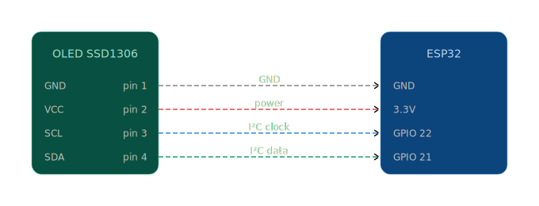

# Invictaeria ESP32 Airplane Detection System

## Overview

**Invictaeria** is an IoT system built with an ESP32 microcontroller that detects the nearest airplane in real time using the [OpenSky Network API](https://opensky-network.org/), displaying live flight data on an OLED screen. Developed as an academic project during the CTeSP in Cybersecurity at [ISTEC](https://istec-porto.pt)(Instituto Superior de Tecnologias Avançadas do Porto), the system demonstrates practical skills in embedded systems, API integration, real-time data processing, and hardware prototyping.

## How it works

The device runs a continuous loop: connect to WiFi, determine its own location, query live air traffic data, calculate the nearest aircraft, and render the result on screen, refreshing automatically every 30 seconds.

### WiFi connection

The ESP32 connects to a configured WiFi network on boot. A loading bar is displayed on the OLED during the connection process, giving visual feedback before any data is fetched.

### Geolocation

Once online, the device determines its own geographic position using IP-based geolocation APIs. This location is used as the centre point for all subsequent aircraft queries.

### Aircraft detection

The system queries the OpenSky Network REST API for all aircraft currently within a configurable radius of approximately 50 km from the device's position. The response includes raw ADS-B data for every tracked aircraft in range.

### Nearest aircraft calculation

Using the Haversine formula, the device calculates the great-circle distance to each aircraft in the response and identifies the closest one. This ensures accurate distance calculation regardless of geographic position.

### OLED display

Flight data is rendered on a 128×64 OLED screen. Each refresh displays the ICAO24 identifier, callsign, latitude, longitude, altitude, velocity, distance, ground status, and a directional heading arrow indicating where the aircraft is relative to the device.

### Auto-refresh

Data refreshes every 30 seconds. A countdown timer is displayed on screen between refreshes so the user knows when the next update will occur.

## Hardware Components

| Component | Specification |
|-----------|--------------|
| **Microcontroller** | ESP32 (WiFi-enabled) |
| **Display** | SSD1306 OLED 128×64 (I²C) |
| **LED Indicators** | Blue LED (GPIO 2) — WiFi status |
| **Power** | USB / 3.3V |

## Software Stack

| Technology | Purpose |
|------------|---------|
| **C++ (Arduino)** | Firmware development |
| **ArduinoJson** | JSON parsing for API responses |
| **Adafruit SSD1306** | OLED display driver |
| **Adafruit GFX** | Graphics primitives library |
| **OpenSky Network API** | Live aircraft transponder data |
| **Arduino IDE** | Development environment |

## Dependencies

The following Arduino libraries are required. All are available via the Arduino Library Manager or the links provided.

| Library | Source | Purpose |
|---------|--------|---------|
| WiFi.h | Built-in (ESP32 core) | WiFi connectivity |
| HTTPClient.h | Built-in (ESP32 core) | HTTP requests to REST APIs |
| ArduinoJson.h | [ArduinoJson](https://arduinojson.org) | JSON deserialization |
| Wire.h | Built-in (ESP32 core) | I²C communication protocol |
| Adafruit_GFX.h | [Adafruit GFX Library](https://github.com/adafruit/Adafruit-GFX-Library) | Graphics primitives |
| Adafruit_SSD1306.h | [Adafruit SSD1306](https://github.com/adafruit/Adafruit_SSD1306) | OLED display driver |

## Wiring Diagram

## Photos

| | |
|:---:|:---:|
|  |  |
| Box Construction | Device Exterior View |
|  |  |
| System in Operation | Top View (Open) |
|  |  |
| Top View (Closed) | Top View (Open 2) |

## Source Files

| File | Description |
|------|-------------|
| [`src/final.ino`](src/final.ino) | Final version with bearing calculation, `ipinfo.io` geolocation, and refined display |
| [`src/projetoESPFuncional.ino`](src/projetoESPFuncional.ino) | Functional version with `ip-api.com` geolocation and LED indicators |

## Project Structure

- README.md — this file
- LICENSE — MIT License
- .portfolio.json — portfolio site integration metadata
- .gitignore — ignores build artifacts and temp files
- docs/
  - Invictaeria_Report_ENG.pdf — full report (English)
  - Invictaeria_Relatorio_PT.pdf — full report (Portuguese)
- diagrams/
  - invictaeria_uml_class_diagram.svg — UML class diagram
  - esp32_oled_wiring_diagram.svg — OLED to ESP32 wiring diagram
- src/
  - final.ino — final firmware version
  - projetoESPFuncional.ino — functional firmware version
- assets/
  - social-preview.jpg — social preview image for link cards
- imgs/ — project photos

## Contact

- **Email:** sam.oliveira.dev@gmail.com
- **Compose in Gmail:** [Gmail](https://mail.google.com/mail/?view=cm&fs=1&to=sam.oliveira.dev@gmail.com&su=Invictaeria%20inquiry&body=Hi%20Samuel%2C%0A)
- **Compose in Outlook:** [Outlook](https://outlook.live.com/owa/?path=/mail/action/compose&to=sam.oliveira.dev@gmail.com&subject=Invictaeria%20inquiry&body=Hi%20Samuel%2C%0A)
- **LinkedIn:** [linkedin.com/in/jose-samuel-oliveira](https://www.linkedin.com/in/jose-samuel-oliveira)
- **Website:** [sam-ciber-dev.github.io](https://sam-ciber-dev.github.io)

## License

This project is licensed under the [MIT License](LICENSE). See [LICENSE](LICENSE) for details.

## Social Preview

The social preview image used for link cards:

## Badges

